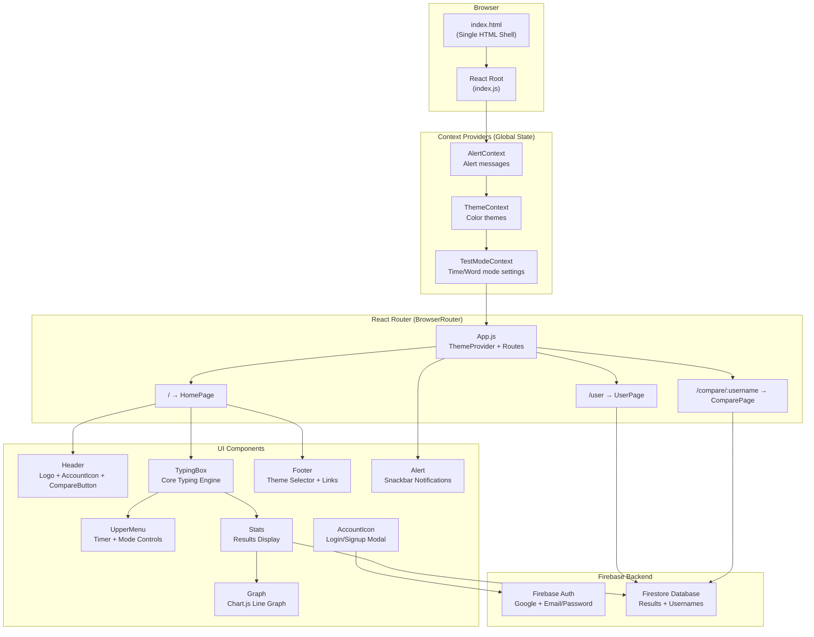
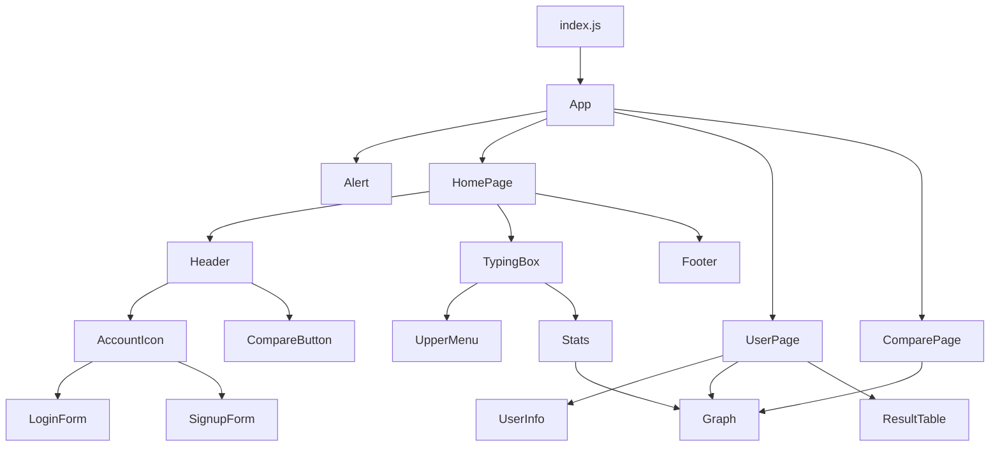
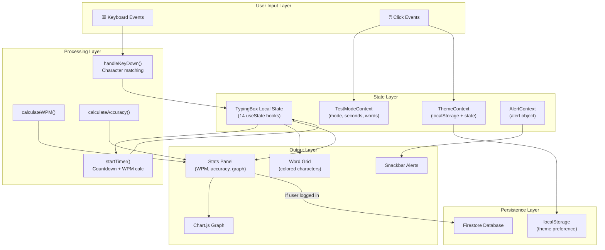
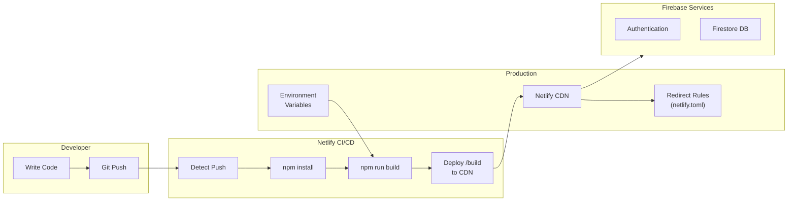

# 🚀 PROJECT DEEP DIVE — Typing Speed Test

> **A comprehensive, beginner-friendly guide to every aspect of this project.**
> If you know nothing about React, coding, or web development — start here.

---

## Table of Contents

1. [Project Overview](#1️⃣-project-overview)
2. [Tech Stack Explanation](#2️⃣-tech-stack-explanation-beginner-friendly)
3. [Folder Structure Breakdown](#3️⃣-folder-structure-breakdown)
4. [Application Architecture](#4️⃣-application-architecture)
5. [Component-Level Deep Dive](#5️⃣-component-level-deep-dive)
6. [Data Flow Explanation](#6️⃣-data-flow-explanation)
7. [State Management Breakdown](#7️⃣-state-management-breakdown)
8. [Logic Explanation (Very Detailed)](#8️⃣-logic-explanation-very-detailed)
9. [Styling System](#9️⃣-styling-system)
10. [Build & Deployment](#🔟-build--deployment)
11. [Performance Analysis](#1️⃣1️⃣-performance-analysis)
12. [Security Considerations](#1️⃣2️⃣-security-considerations)
13. [Improvement Roadmap](#1️⃣3️⃣-improvement-roadmap)
14. [Learning Guide Section](#1️⃣4️⃣-learning-guide-section)

---

## 1️⃣ Project Overview

### What This Project Is

This is an **interactive typing speed test web application** — similar to popular sites like [Monkeytype](https://monkeytype.com) or [TypeRacer](https://play.typeracer.com). It lets users test how fast and accurately they can type, displays their results with charts, and optionally saves their history to a database.

### What Problem It Solves

- **Practice typing speed**: Users can measure their Words Per Minute (WPM) and accuracy.
- **Track progress over time**: Logged-in users can view a history of all their past tests with graphs.
- **Compare with friends**: Users can compare their performance graphs against another user by username.
- **Themed experience**: Multiple beautiful color themes to choose from.

### Who It Is For

- Anyone wanting to improve typing speed.
- Students learning React who want a real-world project to study.
- Developers looking for a reference implementation of Firebase + React.

### High-Level Explanation

1. The app generates a set of **random English words**.
2. The user types those words in real time. Each character is checked **instantly** against the expected word.
3. A **timer** counts down (time mode) or the app tracks words completed (word mode).
4. When the test ends, **results** are displayed: WPM, accuracy, character stats, and a WPM-over-time graph.
5. If the user is **logged in** (via Google or email/password), results are saved to **Firebase Firestore**.
6. Users can visit a **profile page** to see all past results and a historical graph.
7. Users can **compare** their graph with another user's by entering their username.

---

## 2️⃣ Tech Stack Explanation (Beginner Friendly)

### React (v18)

**What is React?** React is a JavaScript library for building user interfaces. Instead of writing raw HTML that changes when data changes, you write **components** — reusable building blocks that automatically re-render when their data updates.

**What this project uses from React:**

| Concept | What It Is | Where It's Used |
|---------|-----------|-----------------|
| **Components** | Reusable UI building blocks (functions that return JSX) | Every `.jsx` file |
| **Props** | Data passed from a parent component to a child | `Stats`, `UpperMenu`, `Graph`, `ResultTable` |
| **useState** | A Hook that lets components have their own "memory" (state) | `TypingBox`, `AccountIcon`, `LoginForm`, etc. |
| **useEffect** | A Hook that runs code after render (side effects) | `TypingBox`, `Stats`, `UserPage` |
| **useLayoutEffect** | Like useEffect but fires synchronously after DOM mutations | `TypingBox` (resetting test on mode change) |
| **useRef / createRef** | A way to directly access DOM elements | `TypingBox` (hidden input, word span refs) |
| **useContext** | A Hook to consume shared global state | Theme, TestMode, Alert contexts |
| **useMemo** | Memoize expensive calculations (commented out in code) | Referenced but not actively used |
| **Context API** | React's built-in way to share state across the component tree | 3 Context providers wrap the app |

### Libraries Used

| Library | Purpose | Why It's Needed |
|---------|---------|-----------------|
| `react-router-dom` v6 | Client-side page routing | Navigate between Home, User, and Compare pages |
| `firebase` v9 | Backend-as-a-Service | Authentication (Google, email/password) & Firestore database |
| `react-firebase-hooks` | React hooks for Firebase | Simplifies auth state management with `useAuthState` |
| `styled-components` | CSS-in-JS styling | Global styles that respond to the current theme |
| `@mui/material` + `@material-ui/core` | Material UI components | Modals, Tabs, TextFields, Tables, Icons, Snackbar alerts |
| `react-select` | Dropdown select component | Theme selector in the footer |
| `chart.js` + `react-chartjs-2` | Chart rendering | WPM-over-time line graphs |
| `random-words` | Random English word generator | Generates the words the user must type |
| `react-google-button` | Pre-styled Google sign-in button | "Sign in with Google" button in the auth modal |

### Build Tool — Create React App (CRA)

This project uses **Create React App (CRA)** as its build tool. CRA is a zero-config setup that handles:

- **Webpack** — bundles all JS/CSS/assets into optimized files
- **Babel** — transpiles modern JavaScript (JSX, ES6+) to browser-compatible code
- **Development server** — hot-reloading at `localhost:3000`
- **Production build** — minified, optimized bundle via `npm run build`

You can tell it's CRA because of `react-scripts` in `package.json`.

### Netlify Configuration

The file `netlify.toml` contains:

```toml
[[redirects]]
from = "/*"
to = "/index.html"
status = 200
```

**What this does:** Since this is a Single Page Application (SPA) with client-side routing, all URL paths (e.g., `/user`, `/compare/john`) need to be redirected to `index.html`. Without this, navigating directly to `/user` would return a 404 error on Netlify because there's no actual `user.html` file on the server.

### How Deployment Works

1. Push code to a Git repository (e.g., GitHub).
2. Netlify watches the repository for changes.
3. On push, Netlify runs `npm run build` to create a production bundle.
4. The built files are served from Netlify's CDN.
5. Environment variables (Firebase API keys) are configured in Netlify's dashboard.

---

## 3️⃣ Folder Structure Breakdown

```
TYPING-SPEED-TEST/
├── public/                          # Static files served as-is
│   ├── index.html                   # The single HTML page (SPA entry point)
│   ├── favi.svg                     # Custom SVG favicon
│   ├── favicon.ico                  # Fallback ICO favicon
│   ├── logo192.png                  # PWA icon (192x192)
│   ├── logo512.png                  # PWA icon (512x512)
│   ├── manifest.json                # PWA metadata (app name, icons, colors)
│   └── robots.txt                   # Search engine crawler instructions
│
├── src/                             # All application source code
│   ├── index.js                     # 🚪 Entry point — renders App into the DOM
│   ├── App.js                       # 🏗️ Root component — routing & theme provider
│   ├── firebaseConfig.js            # 🔥 Firebase initialization & exports
│   ├── pastille-methode.svg         # Logo SVG image
│   │
│   ├── Components/                  # 🧱 Reusable UI components
│   │   ├── TypingBox.jsx            # ⌨️ CORE — the typing test engine
│   │   ├── UpperMenu.jsx            # ⏱️ Timer display & mode selector
│   │   ├── Stats.jsx                # 📊 Post-test results display
│   │   ├── Graph.jsx                # 📈 Chart.js line graph wrapper
│   │   ├── Header.jsx               # 🔝 Top bar with logo & account icon
│   │   ├── Footer.jsx               # 🔽 Bottom bar with hints & theme selector
│   │   ├── AccountIcon.jsx          # 👤 Auth modal (login/signup/Google)
│   │   ├── LoginForm.jsx            # 🔑 Email/password login form
│   │   ├── SignupForm.jsx           # ✍️ Registration form with username
│   │   ├── Alert.jsx                # 🔔 Snackbar notification system
│   │   ├── CompareButton.jsx        # 🆚 Username input to compare stats
│   │   ├── ResultTable.jsx          # 📋 Table of past test results
│   │   └── UserInfo.jsx             # 👤 User profile card
│   │
│   ├── Context/                     # 🌐 React Context providers (global state)
│   │   ├── ThemeContext.jsx          # 🎨 Current theme + setter
│   │   ├── TestModeContext.jsx       # ⚙️ Test mode, seconds, word count
│   │   └── AlertContext.jsx          # 🔔 Alert message state
│   │
│   ├── Pages/                       # 📄 Route-level page components
│   │   ├── HomePage.jsx             # 🏠 Main typing test page
│   │   ├── UserPage.jsx             # 👤 User profile & history page
│   │   └── ComparePage.jsx          # 🆚 Side-by-side comparison page
│   │
│   ├── Styles/                      # 🎨 Global styling
│   │   └── global.js                # 💅 styled-components GlobalStyles
│   │
│   └── Utils/                       # 🔧 Utility/helper files
│       ├── theme.js                 # 🎨 Theme color definitions
│       └── errorMapping.js          # ❌ Firebase error code → friendly message
│
├── package.json                     # 📦 Dependencies, scripts, config
├── netlify.toml                     # 🌐 Netlify deployment config
├── yarn.lock                        # 🔒 Locked dependency versions
└── README.md                        # 📖 Brief project description
```

### Why Each Folder Exists

| Folder | Purpose | Connection to App |
|--------|---------|-------------------|
| `public/` | Static assets that don't go through the build pipeline | `index.html` is the shell where React mounts |
| `src/Components/` | Reusable, self-contained UI pieces | Composed together inside Pages |
| `src/Context/` | Global state accessible from any component | Wraps the entire app in `index.js` |
| `src/Pages/` | Top-level views mapped to URL routes | Referenced in `App.js` route definitions |
| `src/Styles/` | Centralized styling with theme-awareness | `GlobalStyles` injected in `App.js` |
| `src/Utils/` | Pure helper data (no JSX, no components) | Imported where needed (Footer, LoginForm, etc.) |

---

## 4️⃣ Application Architecture



### Architecture Decisions

1. **Context API over Redux**: The app has simple, minimal global state (theme, test mode, alerts). Redux would be overkill.
2. **Styled-components for theming**: `GlobalStyles` receives the theme object via `ThemeProvider`, making every CSS rule theme-aware.
3. **Firebase for zero-backend**: No custom server needed. Auth and database are handled by Firebase services.
4. **Component-level state in TypingBox**: All typing logic lives in one component, keeping the typing engine self-contained.

---

## 5️⃣ Component-Level Deep Dive

### Component Relationship Diagram



---

### 📄 `index.js` — Application Entry Point

- **What it does**: Creates the React root and renders the entire app into the `<div id="root">` in `index.html`.
- **Key detail**: Wraps `App` in **three nested Context Providers** and `BrowserRouter`:

```
AlertContextProvider → ThemeContextProvider → TestModeContextProvider → BrowserRouter → App
```

- **Why this order matters**: Outer providers are available to inner ones. Alert is outermost because even the theme selector might need alerts.

---

### 📄 `App.js` — Root Component

- **What it does**: Applies the theme via `ThemeProvider`, injects `GlobalStyles`, renders the `Alert` component, and defines all routes.
- **Props**: None (root component).
- **State**: None directly (consumes `useTheme()` from context).
- **Hooks**: `useTheme()` to get the current theme.
- **Routes**:
  - `/` → `HomePage`
  - `/user` → `UserPage`
  - `/compare/:username` → `ComparePage`

---

### ⌨️ `TypingBox.jsx` — The Core Typing Engine (Most Complex Component)

This is the **heart of the application** — ~400 lines handling all typing logic.

**State it manages (14 pieces of state!):**

| State Variable | Type | Purpose |
|---------------|------|---------|
| `words` | `string[]` | Array of random words to type |
| `currCharIndex` | `number` | Current character position within the current word |
| `currWordIndex` | `number` | Current word position in the array |
| `countDown` | `number` | Remaining seconds on the timer |
| `testTime` | `number` | Total test duration (for WPM calculation) |
| `correctChars` | `number` | Count of correctly typed characters |
| `correctWords` | `number` | Count of fully correct words |
| `incorrectChars` | `number` | Count of incorrectly typed characters |
| `missedChars` | `number` | Count of characters skipped (jumped to next word early) |
| `extraChars` | `number` | Count of extra characters typed beyond word length |
| `graphData` | `array` | Array of `[time, wpm]` data points for the graph |
| `testStart` | `boolean` | Whether the test has begun |
| `testEnd` | `boolean` | Whether the test has finished |
| `intervalId` | `number` | ID of the timer interval (for cleanup) |
| `open` | `boolean` | Whether the redo/reset dialog is open |
| `wordSpanRef` | `ref[]` | Array of refs to each word's `<span>` DOM element |
| `initialRender` | `boolean` | Flag to prevent reset on first render |

**Hooks used:**
- `useState` × 16 — for all state above
- `useRef` — for the hidden input element
- `useEffect` — focus input and set initial cursor on mount
- `useLayoutEffect` — reset test when mode/seconds/words change (synchronous to avoid flicker)
- `useTestMode()` — context hook for test configuration

**Key functions:**

| Function | Purpose |
|----------|---------|
| `handleKeyDown(e)` | Main event handler — processes every keystroke |
| `startTimer()` | Starts the countdown interval, calculates ongoing WPM |
| `resetTest()` | Generates new words and resets all state |
| `redoTest()` | Resets state but keeps the same words |
| `calculateWPM()` | Computes final Words Per Minute |
| `calculateAccuracy()` | Computes accuracy percentage |
| `focusInput()` | Focuses the hidden input element |
| `resetWordSpanRefClassname()` | Clears all character styling classes |
| `handleDialogBoxEvents(e)` | Handles redo/reset dialog keyboard events |

**Rendering logic:**
- If `testEnd` is `true` → renders `<Stats>` with calculated results
- If `testEnd` is `false` → renders the word grid with character spans
- Always renders a hidden `<input>` to capture keystrokes
- Always renders a MUI `<Dialog>` for the redo/reset overlay

---

### ⏱️ `UpperMenu.jsx` — Timer & Mode Controls

- **Props**: `countDown` (number), `currWordIndex` (number)
- **State**: None directly (reads from `TestModeContext`)
- **What it renders**:
  - **Time mode**: Shows countdown timer + time options (15s, 30s, 60s)
  - **Word mode**: Shows `currentWord/totalWords` progress + word options (10, 20, 30)
  - Mode toggle buttons (Time / Word)
- **Active highlighting**: Current selection gets the `active` or `active-value` CSS class

---

### 📊 `Stats.jsx` — Post-Test Results

- **Props**: `wpm`, `accuracy`, `correctChars`, `incorrectChars`, `missedChars`, `extraChars`, `graphData`, `resetTest`
- **State**: None
- **Hooks**: `useEffect` (to save results), `useAuthState` (check login), `useAlert`
- **Side effect on mount**: If user is logged in, saves results to Firestore. If not, shows "login to save" warning.
- **Graph data deduplication**: Uses a `Set` to filter out duplicate time entries from `graphData`.
- **Renders**: Left panel (WPM, accuracy, character breakdown, restart button) + Right panel (Graph)

---

### 📈 `Graph.jsx` — Chart.js Line Graph

- **Props**: `graphData` (array of `[x, y]`), `type` (optional: `'date'` or default)
- **What it does**: Renders a `<Line>` chart using `react-chartjs-2`
- **Dynamic labels**: If `type === 'date'`, x-axis shows dates; otherwise shows second numbers
- **Theming**: Border color uses `theme.title` from context

---

### 👤 `AccountIcon.jsx` — Authentication Modal

- **State**: `open` (modal visibility), `value` (tab index: 0=Login, 1=Signup)
- **Hooks**: `useAuthState`, `useNavigate`, `useAlert`, `useTheme`
- **Behavior**:
  - If user is logged in → clicking navigates to `/user`
  - If not logged in → opens modal with Login/Signup tabs + Google sign-in
- **Google sign-in**: Uses `signInWithPopup` with `GoogleAuthProvider`, saves username→uid mapping in Firestore `usernames` collection
- **Logout**: Calls `auth.signOut()` and shows alert

---

### 🔑 `LoginForm.jsx` — Email/Password Login

- **Props**: `handleClose` (function to close the modal)
- **State**: `email`, `password`
- **Validation**: Checks both fields are filled before submitting
- **Auth**: Uses `auth.signInWithEmailAndPassword()`
- **Error handling**: Maps Firebase error codes to friendly messages via `errorMapping`

---

### ✍️ `SignupForm.jsx` — Registration Form

- **Props**: `handleClose`
- **State**: `email`, `password`, `confirmPassword`, `username`
- **Validation**: All fields required + password match check + username availability check
- **Username check**: Queries Firestore `usernames` collection to ensure uniqueness
- **Auth**: Uses `auth.createUserWithEmailAndPassword()`, then stores username→uid in Firestore

---

### 🔔 `Alert.jsx` — Snackbar Notification

- **State**: Reads `alert` from `AlertContext`
- **Behavior**: Shows a MUI `Snackbar` with `Slide` transition, auto-hides after 2 seconds
- **Position**: Top-right corner
- **Types**: `success`, `error`, `warning` (controls color/icon)

---

### 🆚 `CompareButton.jsx` — Compare Feature Trigger

- **State**: `open` (modal), `username` (input)
- **Guard**: Only opens modal if user is logged in; otherwise shows alert
- **Submit**: Checks if entered username exists in Firestore, then navigates to `/compare/:username`

---

### 📋 `ResultTable.jsx` — Historical Results Table

- **Props**: `data` (array of result objects)
- **Renders**: MUI `Table` with columns: WPM, Accuracy, Characters, Date
- **Scrollable**: Container has `maxHeight: 30rem`

---

### 👤 `UserInfo.jsx` — User Profile Card

- **Props**: `totalTestTaken` (number)
- **Hooks**: `useAuthState` to get user email and creation time
- **Renders**: Account icon, email, join date, total test count

---

### 📄 `HomePage.jsx` — Main Page

- **Renders**: `Header` → `TypingBox` → `Footer` inside a `.canvas` grid
- **Note**: Generates 100 random words (passed as prop but TypingBox generates its own internally)

---

### 📄 `UserPage.jsx` — Profile Page

- **State**: `data` (results array), `graphData`, `dataLoading`
- **Data fetching**: Queries Firestore for all results where `userID` matches current user, ordered by timestamp
- **Guard renders**:
  - Not logged in → "Login to view user page!"
  - Loading → `CircularProgress` spinner
  - No data → "Take some tests then come back!!"
- **Renders**: `UserInfo` + historical `Graph` (type='date') + `ResultTable`

---

### 📄 `ComparePage.jsx` — Comparison Page

- **URL param**: `:username` extracted via `useParams()`
- **Data fetching**: Fetches results for both the logged-in user and the compared user
- **UID lookup**: Gets the compared user's UID from the `usernames` collection
- **Renders**: Two `Graph` components side by side

---

## 6️⃣ Data Flow Explanation

### How Data Moves Through the App



### Where State Is Stored

| Location | What's Stored | Persistence |
|----------|--------------|-------------|
| `TypingBox` local state | All typing test data (chars, words, timer, refs) | Lost on unmount/refresh |
| `TestModeContext` | Test mode ('time'/'word'), seconds, word count | Lost on refresh |
| `ThemeContext` | Current color theme | Persisted via `localStorage` |
| `AlertContext` | Current alert message object | Lost on refresh |
| `Firestore 'Results'` | WPM, accuracy, characters, userID, timestamp | Permanent (cloud) |
| `Firestore 'usernames'` | username → uid mapping | Permanent (cloud) |
| `localStorage` | Theme preference JSON | Persisted in browser |

### What Triggers Re-Renders

1. **Every keystroke** → `setCurrCharIndex`, `setCorrectChars`, `setIncorrectChar` → TypingBox re-renders
2. **Every second** → `setCountDown` → timer display updates → graph data appended
3. **Mode change** → `setTestMode/setTestSeconds/setTestWords` in context → `useLayoutEffect` triggers `resetTest()`
4. **Theme change** → `setTheme` in context → entire app re-renders with new colors
5. **Alert fired** → `setAlert` in context → Alert Snackbar appears/disappears
6. **Auth state change** → `useAuthState` hook → AccountIcon, Stats, UserPage re-render

### How Typing Input Is Processed

1. User presses a key → `onKeyDown` fires on the hidden `<input>`.
2. `handleKeyDown(e)` receives the event.
3. **Tab** → Opens redo/reset dialog.
4. **Non-character keys** (Shift, Ctrl, etc.) → Ignored (`e.key.length > 1`).
5. **Space** → Moves to next word, counts missed chars if any, scrolls if needed.
6. **Backspace** → Moves cursor back, removes extra chars or resets char class.
7. **Regular character** → Compared against expected char:
   - Match → green (`correct` class), increment `correctChars`
   - Mismatch → red (`incorrect` class), increment `incorrectChars`
8. **Extra characters** (typing beyond word length) → New `<span>` created dynamically in the DOM.

### How Speed Is Calculated

**WPM (Words Per Minute):**
```
WPM = (correctChars / 5) / (elapsedTime / 60)
```
- **Why divide by 5?** In typing, one "word" is standardized as **5 characters** (industry standard). So `correctChars / 5` gives the number of "standard words" typed.
- **Why divide elapsed time by 60?** Elapsed time is in seconds; dividing by 60 converts to minutes.
- The result is `Math.round()`-ed to the nearest integer.

**Accuracy:**
```
Accuracy = (correctWords / totalWordsAttempted) × 100
```
- `correctWords` = words where **every character** was typed correctly.
- `totalWordsAttempted` = `currWordIndex` (the number of words the user pressed space on or completed).

---

## 7️⃣ State Management Breakdown

### `useState` Usage

The app uses `useState` extensively. Here's a categorized breakdown:

**TypingBox (16 states):**
- **Test configuration**: `words`, `testTime`, `countDown`, `testStart`, `testEnd`
- **Cursor tracking**: `currCharIndex`, `currWordIndex`
- **Scoring**: `correctChars`, `correctWords`, `incorrectChars`, `missedChars`, `extraChars`
- **Visualization**: `graphData`
- **UI**: `open` (dialog), `intervalId`, `wordSpanRef`, `initialRender`

**Context states:**
- `ThemeContext`: `theme` object (colors), persisted to localStorage
- `TestModeContext`: `testMode` ('time'|'word'), `testSeconds` (15|30|60), `testWords` (10|20|30)
- `AlertContext`: `alert` object (`{open, type, message}`)

**Authentication components:**
- `AccountIcon`: `open`, `value` (tab index)
- `LoginForm`: `email`, `password`
- `SignupForm`: `email`, `password`, `confirmPassword`, `username`
- `CompareButton`: `open`, `username`

**Data pages:**
- `UserPage`: `data`, `graphData`, `dataLoading`
- `ComparePage`: `loggedinUserData`, `loggedinUserGraphData`, `compareUserData`, `compareUserGraphData`

### `useEffect` Usage

| Component | Dependencies | Purpose |
|-----------|-------------|---------|
| `TypingBox` | `[]` (mount only) | Focus input, set initial cursor |
| `Stats` | `[]` (mount only) | Push results to Firestore if logged in |
| `UserPage` | `[loading]` | Fetch user data after auth state resolves |
| `ComparePage` | `[]` (mount only) | Fetch comparison data for both users |

### `useLayoutEffect` Usage

| Component | Dependencies | Purpose |
|-----------|-------------|---------|
| `TypingBox` | `[testSeconds, testWords, testMode]` | Reset test synchronously when settings change; skipped on initial render using `initialRender` flag |

### Derived State

- **WPM** — calculated on-the-fly via `calculateWPM()` (not stored in state)
- **Accuracy** — calculated on-the-fly via `calculateAccuracy()` (not stored in state)
- **Graph deduplication** — `newGraph` in Stats is derived by filtering `graphData` with a `Set`

### Performance Considerations

- **Problem**: TypingBox re-renders on every keystroke (16 state updates possible per key).
- **Mitigation**: The component is relatively lightweight in terms of DOM — the word grid is simple spans.
- **The `startTimer` closure issue**: Uses nested `setCorrectChars` inside `setCountDown` to access the latest `correctChars` value without stale closures.
- **`initialRender` flag**: Prevents `useLayoutEffect` from running `resetTest()` on the first render, which would be wasteful.

### Possible Optimization Areas

1. **`useCallback`** for `handleKeyDown`, `resetTest`, `focusInput` to prevent unnecessary re-creations.
2. **`useMemo`** for the word span refs array (commented out in the code).
3. **`React.memo`** for `UpperMenu`, `Stats`, `Graph` to avoid re-renders when props haven't changed.
4. **Batching state updates**: Multiple `setState` calls in `handleKeyDown` could potentially be batched using `useReducer`.
5. **Ref-based counter**: Track `correctChars` in a ref instead of state to avoid re-renders during typing.

---

## 8️⃣ Logic Explanation (Very Detailed)

### Typing Speed Calculation — Step by Step

```javascript
const calculateWPM = () => {
    return Math.round(
        correctChars / 5 / ((graphData[graphData.length - 1][0] + 1) / 60)
    );
};
```

**Breaking this down:**

1. `correctChars` = total characters typed correctly throughout the test.
2. `correctChars / 5` = number of "standard words" (industry standard: 1 word = 5 characters).
3. `graphData[graphData.length - 1][0]` = the last recorded time value (seconds elapsed, 0-indexed).
4. `+ 1` = because time starts at 0, so if the last entry is `29`, actual elapsed time is `30` seconds.
5. `/ 60` = convert seconds to minutes.
6. `Math.round()` = round to nearest whole number.

**Example:**
- You typed 150 correct characters in 30 seconds.
- `150 / 5 = 30` standard words.
- `30 / (30/60) = 30 / 0.5 = 60` WPM.

### Accuracy Logic

```javascript
const calculateAccuracy = () => {
    return Math.round((correctWords / currWordIndex) * 100);
};
```

- `correctWords` is incremented only when **all characters** in a word are marked `correct` at the moment of pressing space.
- `currWordIndex` is the total number of words attempted.
- **Edge case**: If no words are attempted (`currWordIndex === 0`), this returns `NaN`. The Stats component checks `!isNaN(accuracy)` before saving to the database.

### Timer Logic

```javascript
const startTimer = () => {
    const intervalId = setInterval(timer, 1000);
    setIntervalId(intervalId);
    function timer() {
        setCountDown((prevCountDown) => {
            setCorrectChars((correctChars) => {
                setGraphData((data) => {
                    return [...data, [
                        testTime - prevCountDown,
                        Math.round(correctChars / 5 / ((testTime - prevCountDown + 1) / 60)),
                    ]];
                });
                return correctChars; // Don't actually change it
            });
            if (prevCountDown === 1) {
                setTestEnd(true);
                clearInterval(intervalId);
                return 0;
            }
            return prevCountDown - 1;
        });
    }
};
```

**Why the nested setState pattern?**

This is a clever technique to access the **latest** state values inside a `setInterval` callback. In JavaScript, closures capture the variable's value at the time the function was created. Since `setInterval` runs repeatedly with the same closure, it would always see the **initial** values of `correctChars` and `countDown`.

By using the functional form of `setState` (`setCorrectChars((correctChars) => { ... return correctChars; })`), the function receives the **current** value as a parameter. The function reads it but returns it unchanged — effectively using `setState` as a "read current value" mechanism.

**Every second:**
1. Decrement `countDown` by 1.
2. Read the current `correctChars` value.
3. Calculate the current WPM: `correctChars / 5 / (elapsedSeconds / 60)`.
4. Append a `[elapsedTime, wpm]` data point to `graphData`.
5. If countdown reaches 1, set `testEnd = true` and clear the interval.

### Reset Behavior

**`resetTest()`** — Full reset:
1. Clear all counters (chars, words, extras, missed, graph data).
2. Generate **new random words**.
3. Create new span refs.
4. Reset timer to initial value.
5. Clear CSS classes on all character spans.
6. Remove any dynamically added extra character spans.
7. Set first character as `current` (blinking cursor).
8. Focus the hidden input.

**`redoTest()`** — Same words:
- Same as reset, but **keeps the same words**. Does not call `setWords()` or `setWordSpanRef()`.

### Edge Cases Handled

| Edge Case | How It's Handled |
|-----------|-----------------|
| Pressing non-character keys (Shift, Alt, etc.) | Ignored: `e.key.length > 1` check |
| Typing beyond word length | New `<span>` created dynamically with class `extra incorrect` |
| Backspacing on extra characters | Extra span is removed from the DOM |
| Backspacing at word start | No action (currCharIndex === 0 check) |
| Pressing space before completing a word | Remaining chars marked as `skipped`, `missedChars` incremented |
| Completing the last word (without space) | Test ends when last char of last word is typed correctly |
| Pressing space on the last word | Test ends via `currWordIndex === words.length - 1` check |
| Completing all words in word mode | Test ends, timer is cleared |
| Tab key during active test | Pauses timer, opens dialog |
| Invalid accuracy (0 words attempted) | Firestore save skipped, "invalid test" error shown |
| Word mode timer | Set to 180 seconds (3 minutes) as a generous maximum |

### Character Scrolling

```javascript
if (wordSpanRef[currWordIndex + 1].current.offsetLeft <
    wordSpanRef[currWordIndex].current.offsetLeft) {
    wordSpanRef[currWordIndex].current.scrollIntoView();
}
```

When the next word's left offset is less than the current word's left offset, it means the next word has **wrapped to a new line**. The current word is scrolled into view to keep the typing area visible.

---

## 9️⃣ Styling System

### CSS Structure

The app uses **styled-components** with a single `GlobalStyles` component defined in `src/Styles/global.js`. This is a CSS-in-JS approach where styles are written as a JavaScript template literal.

**Why styled-components?**
- Dynamic theming: Every CSS property can reference `${({theme}) => theme.propertyName}`.
- No separate CSS files to manage.
- Styles are scoped globally but theme-aware.

### Theme System

5 built-in themes defined in `src/Utils/theme.js`:

| Theme | Background | Title/Accent | Text |
|-------|-----------|-------------|------|
| Super User | `#262A33` (dark gray) | `#43FFAF` (mint green) | `#526777` (slate) |
| Dark Magic | `#091F2C` (navy) | `#A286B8` (lavender) | `#91E4D1` (teal) |
| Bento | `#2D394D` (charcoal) | `#FF7A90` (coral pink) | `#4A768D` (blue-gray) |
| Future Funk | `#2E1A47` (deep purple) | `#fff` (white) | `#C18FFF` (light purple) |
| Aether | `#101820` (near black) | `#EEDAEA` (pale pink) | `#CF6BDD` (orchid) |

Themes are selected via `react-select` dropdown in the Footer and persisted to `localStorage`.

### Key Styling Classes

| Class | Purpose |
|-------|---------|
| `.canvas` | Full-viewport grid layout for pages |
| `.type-box` | Typing area container with overflow hidden (140px height) |
| `.words` | Flexbox container for word spans (32px font, flex-wrap) |
| `.correct` | Green/title-colored character |
| `.incorrect` | Red character |
| `.current` | Left-border blinking cursor animation |
| `.right-current` | Right-border blinking cursor (at end of word) |
| `.skipped` | Gray character (user skipped it) |
| `.hidden-input` | Invisible input capturing keystrokes (`opacity: 0`) |
| `.stats-box` | Flex container for results (30% left, 70% right) |
| `.upper-menu` | 1000px flex row for timer and controls |

### Animations

Two blinking cursor animations:

1. **`blinkingLeft`** — Left border blinks white↔black (for between-character cursor)
2. **`blinkingRight`** — Right border blinks white↔black (for end-of-word cursor)

Both use `animation: 2s infinite ease`.

### Global Theme Transition

```css
body {
    transition: all 0.25s linear;
}
```

This makes all theme changes animate smoothly over 0.25 seconds.

### Responsive Behavior

**Current state**: The app has **limited responsive design**. Many elements have a fixed width of `1000px`:
- `.upper-menu`, `.header`, `.footer`, `.stats-box`, `.user-profile`, `.graph`, `.table`

This means the app works well on screens ≥ 1000px wide but does **not gracefully adapt** to smaller screens (tablets, phones). This is an area for improvement.

### Scrollbar

```css
body::-webkit-scrollbar {
    display: none;
}
```

The default scrollbar is hidden for a cleaner look, but the page remains scrollable via `overflow-y: scroll`.

---

## 🔟 Build & Deployment

### How to Run Locally

```bash
# 1. Clone the repository
git clone <repository-url>
cd TYPING-SPEED-TEST

# 2. Install dependencies
npm install

# 3. Create a .env file with Firebase credentials
# (Required environment variables)
REACT_APP_API_KEY=your_api_key
REACT_APP_AUTH_DOMAIN=your_project.firebaseapp.com
REACT_APP_PROJECT_ID=your_project_id
REACT_APP_STORAGE_BUCKET=your_project.appspot.com
REACT_APP_MESSAGING_SENDER_ID=your_sender_id
REACT_APP_APP_ID=your_app_id
REACT_APP_MEASUREMENT_ID=your_measurement_id

# 4. Start the development server
npm start
# Opens at http://localhost:3000
```

### NPM Scripts Explained

| Script | Command | What It Does |
|--------|---------|-------------|
| `npm start` | `react-scripts start` | Starts dev server with hot-reloading on port 3000 |
| `npm run build` | `react-scripts build` | Creates optimized production bundle in `/build` folder |
| `npm test` | `react-scripts test` | Runs test suite in watch mode (Jest) |
| `npm run eject` | `react-scripts eject` | ⚠️ Irreversible — exposes all CRA config files for customization |

### Production Build Process

1. `npm run build` runs Webpack in production mode.
2. JavaScript is minified, tree-shaken, and code-split.
3. CSS is extracted and minified.
4. Assets are hashed for cache-busting (e.g., `main.a1b2c3.js`).
5. Output goes to the `/build` folder.
6. The `/build` folder contains static files ready to be served by any web server.

### Netlify Configuration

```toml
[[redirects]]
from = "/*"
to = "/index.html"
status = 200
```

**What this does**: This is a **catch-all redirect** essential for Single Page Applications. When a user navigates to `/user` and refreshes the page, the server would normally look for a file at `/user/index.html` which doesn't exist. This rule tells Netlify to always serve `/index.html` and let React Router handle the URL on the client side. The `200` status means it's a **rewrite** (not a redirect), so the URL stays the same.

### Deployment Pipeline



**Step-by-step:**
1. Developer pushes code to the connected Git repository.
2. Netlify detects the push via webhook.
3. Netlify runs `npm install` to install dependencies.
4. Netlify runs `npm run build` with environment variables injected.
5. The `/build` output is deployed to Netlify's global CDN.
6. Redirect rules from `netlify.toml` are applied.
7. The live site connects to Firebase for auth and database.

---

## 1️⃣1️⃣ Performance Analysis

### Re-Render Behavior

| Event | Components That Re-Render | Frequency |
|-------|--------------------------|-----------|
| Keystroke | `TypingBox` (and children: `UpperMenu`) | ~5-10 times per second |
| Timer tick | `TypingBox` → `UpperMenu` (countdown display) | Every 1 second |
| Theme change | **Entire app** (GlobalStyles re-evaluates) | Rare (user action) |
| Mode change | `TypingBox` (full reset via useLayoutEffect) | Rare (user action) |
| Alert | `Alert` component only | On events (login, save, etc.) |
| Auth state change | `AccountIcon`, `Stats`, `UserPage` | On login/logout |

### Possible Bottlenecks

1. **TypingBox re-renders on every keystroke**: With 16 state variables, multiple `setState` calls per keystroke can cause batched but frequent re-renders. At fast typing speeds (100+ WPM), this means 8-10 characters per second, each triggering a re-render.

2. **DOM manipulation via refs**: The code directly manipulates `className` on DOM elements (e.g., `allChildSpans[currCharIndex].className = "char correct"`). While this bypasses React's virtual DOM (which is fast), it's an anti-pattern that can cause inconsistencies between React's internal state and the actual DOM.

3. **Dynamic span creation**: Extra characters create new `<span>` elements via `document.createElement()`. These are outside React's control and need manual cleanup.

4. **Graph data growth**: `graphData` grows by one entry per second. For a 60-second test, this is 60 entries — negligible. But the nested `setState` pattern in `startTimer` creates a new array copy every second.

5. **Firestore queries without pagination**: `UserPage` and `ComparePage` fetch ALL results for a user. As a user takes more tests (hundreds/thousands), this could become slow.

### Optimization Suggestions

1. **Use `useReducer`** instead of 16 `useState` calls in `TypingBox`. This consolidates state updates and ensures a single re-render per action.

2. **Use `React.memo`** on `UpperMenu`, `Graph`, and `Stats` to prevent unnecessary re-renders when their props haven't changed.

3. **Use `useCallback`** for `handleKeyDown` and other event handlers to maintain stable function references.

4. **Move character tracking to refs**: Use `useRef` for `correctChars`, `incorrectChars`, etc. during the test (they don't need to trigger re-renders). Only convert to state when the test ends.

5. **Paginate Firestore queries**: Limit results to the most recent 50 or 100 with "Load More" functionality.

6. **Virtualize the word list**: For very long word lists (300 words), use windowing (e.g., `react-window`) to only render visible words.

7. **Debounce graph data updates**: Instead of appending every second, batch updates or use a ref.

### How to Scale This App

| Scale Challenge | Solution |
|----------------|----------|
| More users | Firebase handles scaling automatically |
| More test modes | Extract test config into a settings page |
| Real-time leaderboards | Use Firestore real-time listeners (`onSnapshot`) |
| Mobile support | Add responsive CSS with media queries |
| Internationalization | Use `react-intl` or `i18next` for multi-language support |
| Custom word lists | Allow users to upload/select word categories |
| Backend API | Migrate to a custom Node.js backend if Firebase costs increase |

---

## 1️⃣2️⃣ Security Considerations

### Current Security

| Area | Status | Details |
|------|--------|---------|
| **Firebase API Keys** | ✅ Environment variables | Keys stored in `.env`, not committed to Git |
| **Authentication** | ✅ Firebase Auth | Secure, battle-tested auth system |
| **Data validation** | ⚠️ Client-side only | No server-side validation of test results |
| **Input sanitization** | ⚠️ Limited | User input goes directly into Firestore |
| **Firestore rules** | ❓ Unknown | Not visible in the codebase; must be configured in Firebase Console |

### Potential Vulnerabilities

1. **Result manipulation**: Since WPM and accuracy are calculated on the client and sent to Firestore, a malicious user could modify the JavaScript to submit fake results. There is no server-side verification.

2. **Firestore security rules**: The code accesses `db.collection('Results')` and `db.collection('usernames')` directly. If Firestore rules are not properly configured, any authenticated user could read/modify other users' data.

3. **Username enumeration**: The `checkUsernameAvailability()` function reveals whether a username exists. An attacker could probe for usernames.

4. **Console logging**: `console.log(process.env.REACT_APP_API_KEY)` in `firebaseConfig.js` exposes the API key in the browser console. While Firebase API keys are meant to be public (security is enforced by Firestore rules), this is unnecessary exposure.

5. **XSS via dynamic span insertion**: Extra characters create spans with `newSpan.innerText = e.key`. Using `innerText` (not `innerHTML`) is safe, as it escapes HTML entities.

### Recommended Improvements

1. **Remove console.log of API key** from `firebaseConfig.js`.
2. **Implement Firestore security rules**:
   ```
   rules_version = '2';
   service cloud.firestore {
     match /databases/{database}/documents {
       match /Results/{result} {
         allow create: if request.auth != null && request.resource.data.userID == request.auth.uid;
         allow read: if request.auth != null;
         allow delete, update: if false;
       }
       match /usernames/{username} {
         allow read: if request.auth != null;
         allow create: if request.auth != null;
         allow delete, update: if false;
       }
     }
   }
   ```
3. **Server-side result validation**: Use Firebase Cloud Functions to validate WPM (e.g., reject values > 300 WPM as impossible).
4. **Rate limiting**: Prevent users from submitting too many results in a short time.

---

## 1️⃣3️⃣ Improvement Roadmap

| Level | Feature | Difficulty | Why |
|-------|---------|------------|-----|
| 🟢 Easy | Add responsive CSS (media queries) | Low | App is desktop-only; mobile users can't use it |
| 🟢 Easy | Remove `console.log` statements | Low | Debug logs shouldn't be in production |
| 🟢 Easy | Add "Back to Home" button on UserPage | Low | No navigation back from profile page |
| 🟡 Medium | Add word mode categories (programming, medical, etc.) | Medium | Makes the app more useful for different professions |
| 🟡 Medium | Add dark/light mode toggle (not just themed) | Medium | Some users prefer light themes |
| 🟡 Medium | Implement leaderboard page | Medium | Adds competitive element; motivates practice |
| 🟡 Medium | Add keyboard sound effects | Medium | Tactile feedback improves typing experience |
| 🟡 Medium | Show live WPM while typing | Medium | Users want real-time feedback, not just final score |
| 🟡 Medium | Add paragraph/sentence mode | Medium | Typing full sentences tests punctuation and capitalization |
| 🟠 Hard | PWA (Progressive Web App) support | Hard | Offline typing tests; installable on mobile |
| 🟠 Hard | Real-time multiplayer racing | Hard | Type against friends in real-time (WebSockets) |
| 🟠 Hard | Heat map of error-prone keys | Hard | Visual analysis of which keys the user struggles with |
| 🟠 Hard | Custom backend with anti-cheat | Hard | Server-validates results to prevent score manipulation |
| 🔴 Very Hard | AI-powered difficulty adjustment | Very Hard | Adapt word difficulty based on user's skill level |
| 🔴 Very Hard | TypeScript migration | Very Hard | Type safety for the entire codebase; prevents bugs |

---

## 1️⃣4️⃣ Learning Guide Section

### If You Want to Rebuild This from Scratch

Follow this step-by-step learning path. Each step builds on the previous one.

---

### Phase 1: Foundations (1-2 weeks)

**Goal**: Understand the fundamentals before touching React.

1. **HTML & CSS Basics**
   - Learn semantic HTML tags (`div`, `span`, `input`, `button`)
   - Understand CSS Flexbox and Grid (this app uses both)
   - Practice: Build a static "typing test" page with just HTML/CSS

2. **JavaScript Essentials**
   - Variables, functions, arrays, objects
   - DOM manipulation (`document.createElement`, `classList`, `innerText`)
   - Event handling (`addEventListener`, `keydown` events)
   - ES6+: Arrow functions, destructuring, template literals, spread operator
   - Closures (critical for understanding the timer logic)
   - `setInterval` / `clearInterval`
   - Practice: Build a countdown timer in vanilla JS

3. **Asynchronous JavaScript**
   - Promises and `.then()` chains
   - `async` / `await`
   - Practice: Fetch data from a public API

---

### Phase 2: React Fundamentals (2-3 weeks)

**Goal**: Learn React's core concepts.

4. **React Basics**
   - What is a component? (Function components)
   - JSX syntax
   - Props (passing data to children)
   - Rendering lists with `.map()`
   - Conditional rendering (`? :` and `&&`)
   - Practice: Build a simple counter app

5. **React Hooks**
   - `useState` — managing component state
   - `useEffect` — side effects (data fetching, subscriptions)
   - `useRef` — accessing DOM elements directly
   - Practice: Build a todo app with add/delete/edit

6. **React Context API**
   - `createContext`, `useContext`
   - Provider pattern
   - When to use Context vs. props
   - Practice: Add a dark/light theme toggle to your todo app

7. **React Router**
   - `BrowserRouter`, `Routes`, `Route`
   - `useNavigate`, `useParams`
   - Practice: Add multiple pages to your todo app

---

### Phase 3: Building the Typing Test (2-3 weeks)

**Goal**: Build the core typing functionality.

8. **Word Generation & Display**
   - Install `random-words` library
   - Generate an array of random words
   - Render them as character spans
   - Practice: Display 50 random words in a styled grid

9. **Keystroke Handling**
   - Hidden input technique for capturing all keystrokes
   - `onKeyDown` event handler
   - Character-by-character comparison
   - CSS class toggling (correct/incorrect/current)
   - Practice: Make characters turn green/red as you type

10. **Timer & WPM Calculation**
    - `setInterval` for countdown
    - WPM formula: `(correctChars / 5) / (minutes)`
    - Accuracy formula: `(correctWords / totalWords) * 100`
    - Stale closure workaround (functional setState)
    - Practice: Add a countdown timer and show WPM at the end

11. **Results Display & Graph**
    - Install `chart.js` and `react-chartjs-2`
    - Track WPM per second as graph data
    - Display a line chart of WPM over time
    - Practice: Show stats panel with WPM, accuracy, and graph

---

### Phase 4: Backend Integration (1-2 weeks)

**Goal**: Add persistence and authentication.

12. **Firebase Setup**
    - Create a Firebase project
    - Configure Firebase in your app
    - Environment variables for API keys
    - Practice: Connect your app to Firebase

13. **Firebase Authentication**
    - Email/password signup and login
    - Google sign-in with popup
    - `useAuthState` hook from `react-firebase-hooks`
    - Practice: Add login/signup forms and Google auth button

14. **Firestore Database**
    - Save test results with `collection().add()`
    - Query results with `.where()` and `.orderBy()`
    - Display historical data in a table
    - Practice: Save and display past test results for logged-in users

---

### Phase 5: Polish & Deploy (1 week)

**Goal**: Make it production-ready.

15. **Theming System**
    - Create a theme object with colors
    - Use `styled-components` + `ThemeProvider`
    - Theme persistence with `localStorage`
    - Practice: Add a theme selector with at least 3 themes

16. **UI Polish**
    - Add MUI components (Modal, Snackbar, Table)
    - Blinking cursor animation
    - Alert/notification system
    - Practice: Polish every UI element

17. **Deployment**
    - Push to GitHub
    - Connect to Netlify
    - Configure `netlify.toml` for SPA redirects
    - Set environment variables in Netlify dashboard
    - Practice: Deploy and share your live URL!

---

### Concepts to Master (In Order)

1. ✅ HTML/CSS Flexbox & Grid
2. ✅ JavaScript ES6+ (closures, destructuring, async/await)
3. ✅ DOM manipulation & events
4. ✅ React components, JSX, and props
5. ✅ React hooks (useState, useEffect, useRef, useContext)
6. ✅ React Router
7. ✅ Context API for global state
8. ✅ CSS-in-JS (styled-components)
9. ✅ Firebase Auth
10. ✅ Firestore CRUD operations
11. ✅ Chart.js data visualization
12. ✅ Netlify deployment

---

### Recommended Resources

| Resource | Type | Topic |
|----------|------|-------|
| [React Official Docs](https://react.dev) | Documentation | React fundamentals |
| [JavaScript.info](https://javascript.info) | Tutorial | JavaScript deep-dive |
| [Fireship.io](https://fireship.io) | Video tutorials | React + Firebase |
| [Chart.js Docs](https://www.chartjs.org/docs/) | Documentation | Chart.js usage |
| [styled-components Docs](https://styled-components.com/docs) | Documentation | CSS-in-JS |
| [Netlify Docs](https://docs.netlify.com) | Documentation | Deployment |
| [Firebase Docs](https://firebase.google.com/docs) | Documentation | Auth + Firestore |

---

> **📌 Final Note**: This project is an excellent real-world example of a React application. It covers component architecture, state management, event handling, CSS-in-JS theming, Firebase integration, and deployment. By studying each section of this document and cross-referencing with the source code, you will gain a deep understanding of how modern React applications are built.

---

*Generated from a deep analysis of every file in the TYPING-SPEED-TEST project.*
